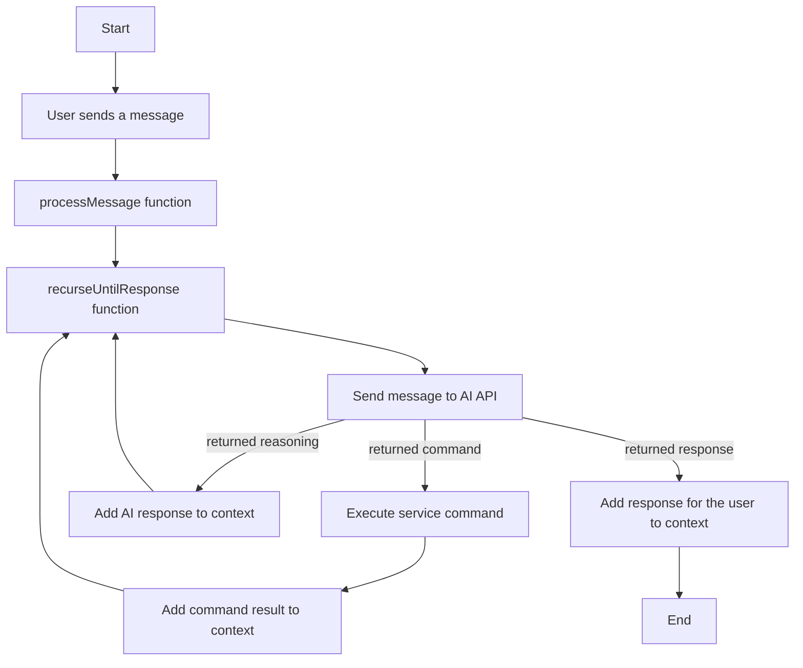

# 🤖 Micro AGI

An advanced AI agent powered by OpenAI, designed to process and respond to messages using the OpenAI API. This agent is built to be flexible, efficient, and easy to integrate into various applications.

## 📜 Table of Contents

- [🤖 Micro AGI](#-micro-agi)
  - [📜 Table of Contents](#-table-of-contents)
  - [🌟 Features](#-features)
  - [🎥 Demo (examples/swapi/index.js)](#-demo-examplesswapiindexjs)
  - [🔧 Installation](#-installation)
  - [🚀 Usage](#-usage)
  - [🔍 API](#-api)
    - [`createAgent(options)`](#createagentoptions)
    - [`agent.processMessage(userMessage)`](#agentprocessmessageusermessage)
    - [`agent.getMessages()`](#agentgetmessages)
  - [🔀 Flowchart](#-flowchart)
  - [🧠 LLM Agent Overview](#-llm-agent-overview)
    - [🔑 Key Components](#-key-components)
  - [📄 License](#-license)

## 🌟 Features

- **Easy Integration**: Designed to be easily integrated into any Node.js application.
- **Powered by OpenAI**: Leverages the power of OpenAI's GPT models for advanced conversational capabilities.
- **Flexible Configuration**: Comes with various configuration options to tailor the agent's behavior.
- **Error Handling**: Robust error handling mechanisms for better reliability.

## 🎥 Demo (examples/swapi/index.js)

As you can see the agent, to respond to the user's question, taps into the swapi service to retrieve the information and then uses the OpenAI API to generate the response. In particular there is no way to have a right response unless **the agent is able to understand that it has to use different services more than once**.
You can see the inner working of the agent

[](https://asciinema.org/a/pa8hSexSSHlM4rGz3dupeW6N9)

## 🔧 Installation

Install the package using npm:

```bash
npm install micro-agi-js
```

## 🚀 Usage

Here's a basic example of how to use the Micro AGI:

```javascript
import { createAgent } from 'micro-agi-js';

const services = {
  // ... your services here ...
};

const options = {
  apiKey: process.env.OPENAI_API_KEY, // your OpenAI API key
  services, // your services
  model: 'gpt-4',
  temperature: 0,
  systemMessage: 'You are an intergalactic barman...',
  commandFunctions: [
    /* ... */
  ],
};

const agent = createAgent(options);

async function main() {
  const userMessage = 'Hello!';
  const response = await agent.processMessage(userMessage);
  console.log(response);
}

main();
```

## 🔍 API

### `createAgent(options)`

Creates an AI agent instance.

- `options`: Configuration options for the agent.
  - `apiKey`: Your OpenAI API key.
  - `services`: Your services.
  - `systemMessage`: (optional) The message to display when the agent starts.
  - `commandFunctions`: (optional) The command functions to use.
  - `model`: (optional) The OpenAI model to use.
  - `temperature`: (optional) The temperature to use for text generation.
  - `isDebug`: (optional) Whether to enable debug mode.

Returns an agent object with methods to process messages and retrieve messages.

### `agent.processMessage(userMessage)`

Processes a user message and returns the agent's response.

- `userMessage`: The message from the user.

### `agent.getMessages()`

Retrieves the current messages from the conversation context.

## 🔀 Flowchart



## 🧠 LLM Agent Overview

An **LLM (Large Language Model) Agent** is an advanced AI entity designed for more than just text generation. It's built to engage in conversations, execute tasks, and demonstrate a level of autonomy, all powered by the OpenAI API.

### 🔑 Key Components

1. **Core LLM**:

   - The foundational layer, a neural network trained on vast datasets, enabling the agent to understand and generate text. This is the primary engine of our Micro AGI.

2. **Prompting Mechanism**:

   - The agent's behavior and expertise are defined by carefully crafted prompts. These prompts, as seen in the code, guide the agent's responses and actions, ensuring it aligns with desired objectives and contexts.

3. **Memory**:

   - Our agent uses a dynamic context window, akin to short-term memory, ensuring continuity in ongoing conversations. This is evident in how the agent processes and responds to user messages, maintaining context throughout the conversation.

4. **Knowledge Base**:

   - Beyond the inherent knowledge of the LLM, our agent can tap into broader expertise, making it versatile across various tasks and users. This is reflected in the agent's ability to understand and respond to diverse user queries effectively.

5. **Tool Integration**:

   - The agent isn't limited to just language generation. As seen in the code, it can integrate with other services and tools, such as executing specific software operations, enhancing its capabilities.

Harness the power of the LLM Agent to elevate your applications, making them more interactive and intelligent.

## 📄 License

This project is licensed under the MIT License. See the [LICENSE](./LICENSE.md) file for details.
